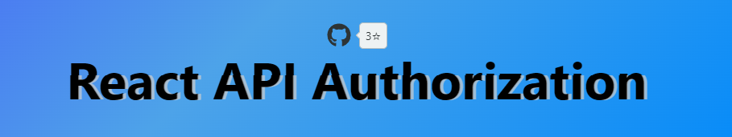
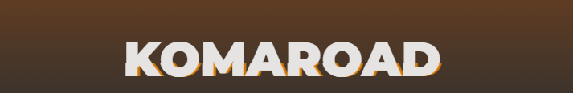

[](https://www.npmjs.com/package/glitch-text)
[](https://standardjs.com)


# Glitch text for ```react``` 🔮


https://user-images.githubusercontent.com/58357980/173233890-9801b49f-5c2b-4f7b-8c0f-b6e6ca0c1f3f.mp4


## This nice and simple ``(1kB)`` react component can help you ``add text glitch animation`` and have some really cool themes, ```like orange glitch or blue glitch```
## The glitch is really smooth, I tried to make more distortion but it's looked awful

----
## Install 💡:
```bash
npm i glitch-text
---
yarn add glitch-text
```

## Usage 🔥:
```jsx
// don't forget change props
import { GlitchText } from 'glitch-text';

 // orange theme by default 
const App = () => {
  return (
    <div style={{ fontSize: '70px' }}>
     
      <GlitchText theme='orange' text={'There are your text'} />

    </div>
  );
};
```
Text fully customazible but try use parents tags for styling

I'm recommend use `50px - 100px range` for more beauty effect


___

## Themes 🎨 (more coming soon):

<ul>
<li>orange - (by default)
<li>blue
<li>green
<li>red
<li>white
<li>purple
</ul>


## Examples 🧤 (hover on text):
---



### Check here - https://react-next-js-api-auth.vercel.app/


### Check here - https://komaroad.netlify.app/ 


---
## Props 🔧:

| props  | required | default  | description |
| ------------- | ------------- | ------------- | ------------- |
| text(string)| yes | - | text where you want use glitch animation |
| theme(string) | yes | orange | glitch color |

